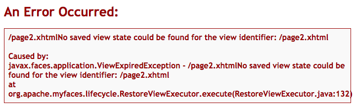

# JSF View State management for @WindowScoped beans

Open Webbeans `@WindowScoped` annotation provides a nice way to separate bean state between different browser windows/tabs running in the same user session. 

JSF on the other hand does not know about window scopes. The view state will still be unaware of multiple windows/tabs being open. Therefor you may run into errors like `View state could be found for the view identifier ...`. 

Apache MyFaces has a configuration parameter for the number of views that are held in a users session.

```
    <context-param>
        <description>Only applicable if state saving method is "server" (= default).
            Defines the amount (default = 20) of the latest views are stored in session.</description>
        <param-name>org.apache.myfaces.NUMBER_OF_VIEWS_IN_SESSION</param-name>
        <param-value>2</param-value>
    </context-param>
```

## Here is an example of what happens
1. Enter a page in your application in browser tab "A".
2. Open the same page in another browser tab (make sure the windowId is different!)
3. Click a command button 2x in tab "B"
4. Both view states (see NUMBER_OF_VIEWS_IN_SESSION configuration above) are now used by tab "B"
5. Go back to tab "A", click
6. An error is displayed

´

## Solution

This project provides window scope aware State Manager implementation.

### Configuration

Add the dependency to your pom.xml

```xml
    <dependency>
        <groupId>at.irian.myfaces.wscope</groupId>
        <artifactId>jsf-wscope-impl</artifactId>
        <version>1.0.1</version>
    </dependency>
```

Add the render-kit config to your faces-config.xml (Enables window scope state management)

```xml
    <render-kit>
        <render-kit-id>HTML_BASIC</render-kit-id>
        <render-kit-class>at.irian.myfaces.wscope.renderkit.html.WsHtmlRenderKitImpl</render-kit-class>
    </render-kit>
```

### Example solution

In directory example run `mvn clean jetty:run`
